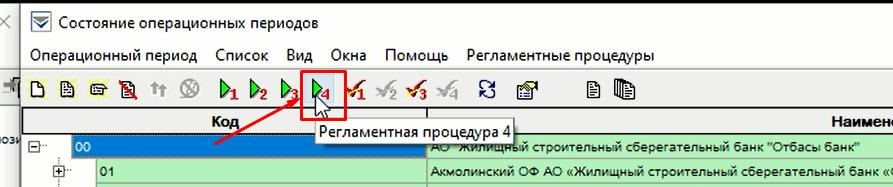

# ШАГ 1.
Переходим в режим «COPPER».
 
В появившемся списке необходимо развернуть список. Необходимо развернуть список, отжать «+» на строке 00 (Рис 1).
 
 

 
 
В столбце «Проц. 4» будут стоять «√». Их снимаем, откликиваем на «Снять признак выполнения регламентной процедуры 4» (рис 2) - действия выполняется только для ГО – «00».
 
 

 
 
Обновляем страницу (рис 3).
 
 

 
 
Кликаем на подразделение «00» и запускаем «Регламентная процедура 4» (рис 4).
 
 

 
 
В окне на «Задать дату вручную» проставляем галочку. Задаем текущую дату. Убираем галочку с «Выполнить для всех подчиненных подразделений» и кликаем на «ОК» (рис 5), подтверждаем действие – кликаем «Да» (рис 6).
 
 

 
 

 
 
Результат в столбце Обр. по 00 будет стоять галочка (Рис 7).
 
 

 
 
Переходим в «Задания на обработку операционных периодов» (рис 8) кликаем на «обновить» до состояния «обработано» (Рис 9).
 
 

 
 
**Необходимо дождаться состояния «обработано» - строчка исчезнет и в столбце проц.4 появится галочка.**

# ШАГ 2.
Выделяем все филиалы от 01 до 31 и запускаем регламент 2 (Рис 10)
 
 

 
 
Проставляем галочку в «задать дату вручную» и проставляем текущую дату, кликаем «ОК» (Рис 11).
 
 

 
 
Также во вкладке «Все задания на обработку ОП» (Рис 12) дожидаемся состояния «обработано».
 
 

 
 
В колонке Проц.2 по мере отработке преставятся галочки (Рис 13)
 
 

 
 