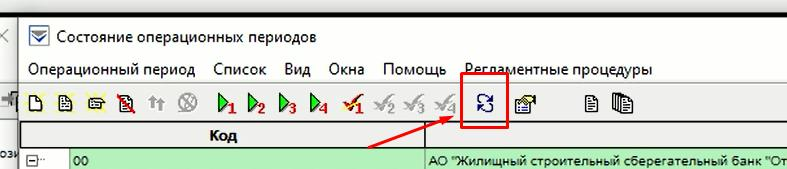

# ШАГ 1.
Переходим в режим «COPPER».
 
В появившемся списке необходимо развернуть список. Необходимо развернуть список, отжать «+» на строке 00 (Рис 1).
  

  
В столбце «Проц. 4» будут стоять «√». Их снимаем, откликиваем на «Снять признак выполнения регламентной процедуры 4» (рис 2) - действия выполняется только для ГО – «00».
  

  
Обновляем страницу (рис 3).
  

  
Кликаем на подразделение «00» и запускаем «Регламентная процедура 4» (рис 4).
  

  
В окне на «Задать дату вручную» проставляем галочку. Задаем текущую дату. Убираем галочку с «Выполнить для всех подчиненных подразделений» и кликаем на «ОК» (рис 5), подтверждаем действие – кликаем «Да» (рис 6).
  

  

  
Результат в столбце Обр. по 00 будет стоять галочка (Рис 7).
  

  
Переходим в «Задания на обработку операционных периодов» (рис 8) кликаем на «обновить» до состояния «обработано» (Рис 9).
  

  
**Необходимо дождаться состояния «обработано» - строчка исчезнет и в столбце проц.4 появится галочка.**

# ШАГ 2.
Выделяем все филиалы от 01 до 31 и запускаем регламент 2 (Рис 10)
  

  
Проставляем галочку в «задать дату вручную» и проставляем текущую дату, кликаем «ОК» (Рис 11).
  

  
Также во вкладке «Все задания на обработку ОП» (Рис 12) дожидаемся состояния «обработано».
  

  
В колонке Проц.2 по мере отработке преставятся галочки (Рис 13)
  

  

# ШАГ 3.
Запускаем регламент 2 по ГО «00»
 
Проставляем галочку в «задать дату вручную» и проставляем текущую дату, снимаем галочку с «Выполнить для всех подчинённых подразделений» и кликаем «ОК» (Рис 14).
  

  
Также во вкладке «Все задания на обработку ОП» дожидаемся состояния «обработано».

# ШАГ 4.
Робот преступает к отработке процесса после получения выписки МТ-950
  
Робот запускает COLVIR. После переходим в режим EXTRCT  (рис 15)
  

  
Выбираем режим «Выписка», в появившемся окне проставляем сегодняшнюю дату и кликаем «ОК». (Рис 16)
  

  
В списке выбираем строку с 950 Типом (рис 17), после чего проверяем наличие квитовки (рис 18).  (В выписке в столбце КВ должны отсутствовать галочки)
  

  

  
Для квитовки счетов необходимо перейти в режим «Автоматическая выверка счетов» и выбираем счет KZ139ХХХ02 (рис 19).
  
Откликиваем «Операции» и «Подготовить документы для системы выверки» (рис 20).
  

  
В появившемся окне задаем текущую дату и кликаем на «ОК» (Рис 21).
  

  
Еще раз откликиваем «Операции» и кликаем на «Сквитовать выбранные счета» (Рис 22). 
  

  
## **Примечание**
  
После квитовки выйдет результат операции с указанием кол-во успешных\неуспешных операции (Рис 23). 
  

  
В случае если неуспешно, необходимо будет запустить «Операции» - «Сквитовать все счета» (Рис 24).
  

  
